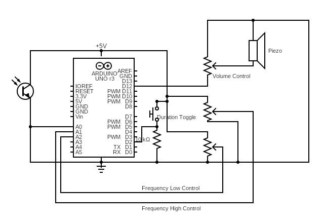
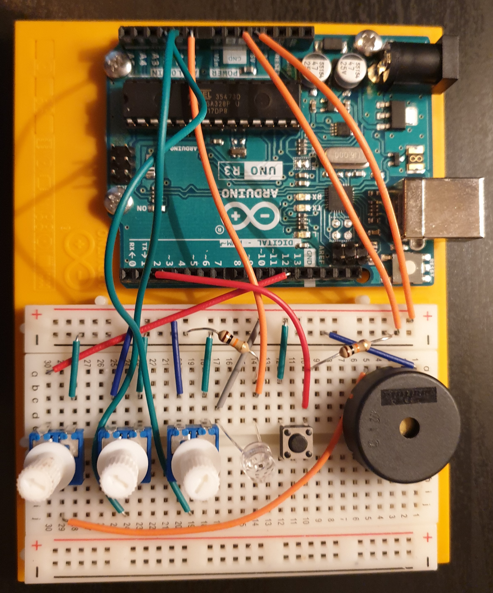

# Light Theramin
A theremin is an electronic musical instrument controlled without physical contact by the thereminist (performer).
This particular varient uses fluctuations in light to determine the sound.

## The Circuit

## Usage
The circuit includes three dials and a button.

- Potentiometer1 (bottom in the photo) adjusts the volume.
- Potentiometer2 (middle in photo) adjusts the minimum frequency of the tone.
- Potentiometer3 (top in photo) adjusts the maximum frequency of the tone.
- The button toggles between choppy beeping tones and a smooth tone

The theramin also features a mode which plays fixed notes rather than a fully variable tone. This can be enabled by turning both
the high and low frequency dials all the way down.

When turned on, the theramin will spend the first 5 seconds calibrating to determine the expected range of light for the room. 
During calibration, move your hand in the sort of motions you'll make while playing so that the expected min and max values can 
be determined. While calibrating, the LED next to pin 13 will glow.